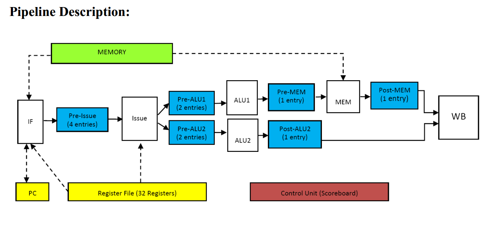

# mips-simulator2
计算机体系结构第二次大作业

## 任务描述
* 输入MIPS二进制文件，输出仿真结果
> MIPSsim inputfilename.txt
* inputfile: inputfilename.txt
* outputfile: simulation.txt

## 指令格式

参考[Project1](https://github.com/No-96/mips-simulator)

## Pipeline Description

## Scoreboarding

* (F) Fetch instruction from cache or prefetch buffer
* (I) Issue inst. to an execution path (when no structural/WAW hazards)
* (R) Read operands (when no RAW hazards remain)
* (E) Execute instruction (possibly multi-cycle)
* (W) Write results (when no WAR hazards remain)